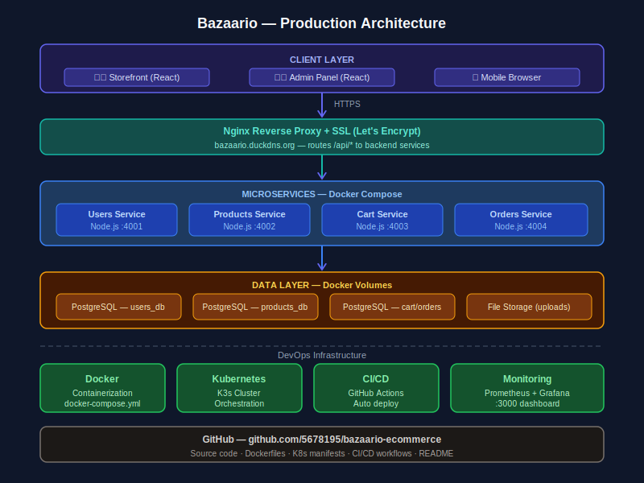

# 🛒 Bazaario — Full-Stack E-Commerce Platform

> Production-grade e-commerce platform built with microservices architecture, containerized with Docker, orchestrated with Kubernetes, and deployed on AWS EC2 with CI/CD via GitHub Actions.

---

## 🌐 Live Links

| | URL |
|---|---|
| 🛍️ Customer Site | https://bazaario.duckdns.org |
| 🔧 Admin Panel | https://bazaario.duckdns.org/admin |
| 📊 Grafana Dashboard |http://98.86.99.37:3000

---

## ✨ Features

- 🔐 JWT-based authentication (register, login, refresh tokens)
- 🛍️ Product catalog with search, category filter, and image upload
- 🛒 Shopping cart with real-time quantity management
- 📦 Order placement with OpenStreetMap location detection
- 👨‍💼 Admin panel — manage products, categories, orders
- 📱 Fully responsive (mobile + desktop)
- 🔒 HTTPS with Let's Encrypt SSL
- 📊 Monitoring with Prometheus + Grafana

---

## 🏗️ Architecture




## 🛠️ Tech Stack

| Layer | Technology |
|-------|-----------|
| Frontend | React, Vite, Tailwind CSS |
| Backend | Node.js, Express.js |
| Database | PostgreSQL |
| Auth | JWT (access + refresh tokens) |
| Maps | OpenStreetMap + Leaflet.js |
| Containerization | Docker, Docker Compose |
| Orchestration | Kubernetes (K3s) |
| CI/CD | GitHub Actions |
| Monitoring | Prometheus + Grafana |
| Deployment | AWS EC2 (Ubuntu 24) |
| Web Server | Nginx + SSL (Let's Encrypt) |

---

## 🚀 Microservices

| Service | Port | Description |
|---------|------|-------------|
| users-service | 4001 | Auth, JWT, user profiles |
| products-service | 4002 | Product CRUD, image upload |
| cart-service | 4003 | Cart management |
| orders-service | 4004 | Order lifecycle |

---

## 🐳 Run Locally with Docker

```bash
git clone https://github.com/5678195/bazaario-ecommerce.git
cd bazaario-ecommerce
docker compose up --build -d

# Health checks
curl http://localhost:4001/health
curl http://localhost:4002/health
curl http://localhost:4003/health
curl http://localhost:4004/health
```

---

## 👨‍💻 Developer

**Zohaib Abbasi** — Computer Science Graduate | Aspiring DevOps Engineer  
📧 abbasizohaib215@gmail.com  
🔗 GitHub: https://github.com/5678195
